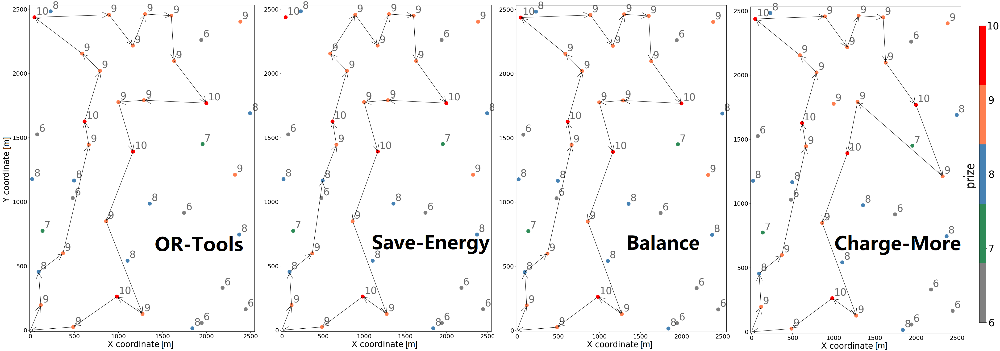
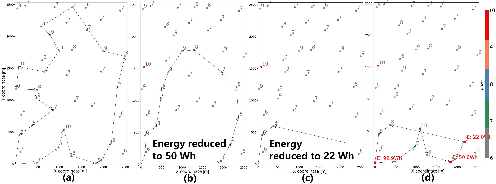

# ROMP

Rapid Online Metaheuristic-based Mission Planner (ROMP) for solving UAV Charging Scheduling Problem (CSP). Please see more details in our [paper](https://arxiv.org/abs/2203.04595). If the code is useful, please feel free to cite our paper: 
```
@article{qian2022practical,
  title={Practical mission planning for optimized uav-sensor wireless recharging},
  author={Qian, Qiuchen and OKeeffe, James and Wang, Yanran and Boyle, David},
  journal={arXiv preprint arXiv:2203.04595},
  year={2022}
}
```

## Quick Start

**Prerequisites**

The source code has been tested on Ubuntu 20.04 LTS. The dependices are listed below:
* [Google OR-Tools (or-tools_x86_64_Ubuntu-20.04_cpp_v9.5.2237)](https://developers.google.com/optimization) 
* [Bazel (6.0.0)](https://bazel.build/)
* [MPICH (mpiexec (OpenRTE) 4.0.3)](https://www.mpich.org/)
* [GCC 9 (gcc & g++ 9.4.0)](https://gcc.gnu.org/gcc-9/)
* [Python3 (3.8.10)](https://www.python.org/)

**Instructions**
1. Follow the [guidance](src/README.md) of how to configure the environment.
2. Create directory as below:
```
ROMP/
|1---->| inp/               # Store needed input files
|1---->| out/               # Store output files  
|1---->| fig/               # Store visualized figures
|1---->| init_solver/       # Store binary executable file of initial solver
|2-------->| cpp_ortools      
|1---->| opt_solver/        # Store binary executable file of optimization solver
|2-------->| cpp_bha 
|1---->| online_romp/       # Store binary executable file of ROMP
|2-------->| cpp_romp         
```
3. Extract [example inputs](example_input/example_input.7z) to `inp/` directory:
```
|1------->| inp/                  # Store needed input files
|2------------>| case0.csv        # Sensor node data
|2------------>| grid_info.txt    # Wind grid data
|2------------>| wind_vector.csv  # Time-vary wind vector data  
```
4. Run a [bash script](scripts/simple_demo.sh) under `CSP/`
```
cd CSP/
./simple_demo.sh
```
5. Users may refer to parameter setting of [Initial Solver & Optimization Solver](src/offline_scheme/README.md), and [ROMP](src/online_scheme/README.md).
6. Obtain results at `out/` directory and visualized figures at `fig/` directory.

## DEMO

Fig.1. An OP instance of OR-Tools’ solution and CBHA’s solutions using different search strategies.



Fig.2. An instance of flight plans with dynamic energy update, where (a) shows the original route plan of the given network; (b) shows the CBHA solution when PDV’s remaining energy is reduced to 50 Wh; (c) shows the CBHA solution when PDV’s remaining energy is reduced to 22 Wh; (d) is the actual route plan after re-planning of (b) and (c)

## Contact
Mr. Qiuchen Qian - qiuchen.qian19@imperial.ac.uk  
Dr. David Boyle - david.boyle@imperial.ac.uk
