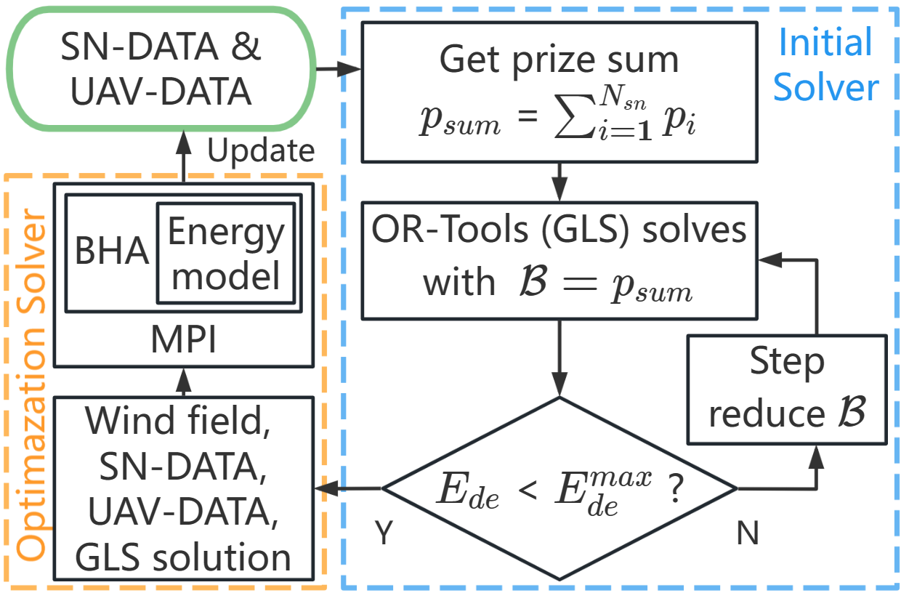

# ROMP
ROMP is the online mission planner algorithm that utilizes the previous given route. Therefore, a previous route has to be provided before running ROMP code. ROMP aims at adding/dropping nodes from the route to match the actual UAV battery. The source code takes few input arguments:
```
mpiexec -n 4 cpp_romp <1> <2> <3> <4> <5> <6> <7> <8> <9> <10> <11>
```
1. input file directory
2. output file directory
3. input instance file name
4. previous simulation result file name
5. output simulation result file name
6. weight coefficient for energy [0, 100]
7. number of populations
8. number of iterations
10. number of searched candidates
11. attraction probability [0, 1]

# Input file format
**NOTICE!** 

The sensor node deployment file is different as the file in offline scheme. Now we use start node (`id = 0`) and end node (`id = 1`) and place them at the 2nd and 3rd row. This is important because the online scheme has a different solver structure. To convert the previous sensor node deployment file of offline scheme, users may use [readjust.py](online_romp/readjust.py). For more details, please see the [example script](../../scripts/simple_demo.sh).

Because now the route involves start and end node, the simulation result file format is different as well.

## Sensor node deployment file
The sensor node deployment file ***for online scheme*** should have a format like below:

| id  | x_pos | y_pos | z_pos | p_flag | volts | weights |
|-----|---|-------|-------|--------|-------|---------|
| 0   | 0 | 0     | 0     | 0      | 0     | 0       |
| 1   | 0 | 0     | 0     | 0      | 0     | 0       |
| 2   | 4029 | 155511 | 0     | 0      | 1.686 | 6       |
| ... | ... | ...   | ...   | ...    | ...   | ...     |

Note that the column name should be same as above table, i.e. `id,x_pos,y_pos,z_pos,p_flag,volts,weights`:
* id: Sensor node ID
* x_pos: The x-coordinate of the sensor node (cm)
* y_pos: The y-coordinate of the sensor node (cm)
* z_pos: The z-coordinate of the sensor node (cm)
* p_flag: The sensor type, check [our paper](https://arxiv.org/abs/2203.04595) for more details
* volts: The current voltage of the sensor node (V)
* weights: The prize weight of this sensor node

## Simulation result file
The previous simulation result file, this file can be generated by either offline scheme algorithm or previous execution of the online scheme. The format should be:
```
Timestamp
0,33,27,...,55,32,1
99.9,97.5203,92.1528,...,38.4033,37.3042,32.6028
0,41.875,136.756,...,1033.85,1043.18,1126.65
```
where the 2nd row is the route; 3rd row is the remaining energy after charging a node; last row is the departure time before next visit.

## Wind grid file
The wind grid file (default file name "grid_info.txt") is for recording the resolution of the wind grid. It should have a format like below:
```
0,0,0,0,2500,2500,400,10000,82,82,5,361
```
Note that "grid_info.txt" only exists a single-row data, there is no column name. From **left to right**, the meaning of each column refers to:
* start x-coordinate (cm)
* start y-coordinate (cm)
* start z-coordinate (cm)
* start time (ms)
* step size of x-coordinate (cm)
* step size of y-coordinate (cm)
* step size of z-coordinate (cm)
* time step (ms)
* number of xs steps 
* number of ys steps 
* number of zs steps
* number of time steps

## Wind vector file
The wind vector file (default file name "wind_vector.csv") is for recording the wind vector of each vertex of each wind cube in the wind grid. It should have a format like below:

| ts      | uv_x | uv_y | uv_z |
|---------|------|------|------|
| 0       | -300 | -200 | 0    |
| ...     | ...  | ...  | ...  |
| 10000   | -300 | -200 | 0    |
| ...     | ...  | ...  | ...  |
| 3600000 | -300 | -200 | 0    |

The above table is an example for the grid resolution mentioned in above Wind grid file section. Note that the column name should be same as above table, i.e. `ts, uv_x, uv_y, uv_z`:
* ts: time
* uv_x: wind speed at x direction (cm/s)
* uv_y: wind speed at y direction (cm/s)
* uv_z: wind speed at z direction (cm/s)

# Output file format
## Execution time file
The execution time file of the online scheme (default name "comp_time.txt"). It should have a single-row data with:
```
timestamp,algorithm_execution_time
```

## Execution summary file
The execution summary file (default name "summary.csv") involves the summary of UAV discharged and recharged energy, and some metrics. It should have a single-row data with below format:

| Timestamp     | M          | DE        | DE_{all}    | RE         | RE_{all}   | Feas |
|---------------|------------|-----------|-------------|------------|------------|------|

where:
* Timestamp: the timestamp of this execution
* M: the fitness metric value of ROMP's route
* DE: UAV discharged energy of ROMP's route
* DE_{all}: UAV initial battery level
* RE: UAV recharged energy of ROMP's route
* RE_{all}: all rechargeable energy of the whole sensor network
* Feas: feasibility of the route

## Simulation result file
The simulation result file has same format as the simulation result file in former section Input file format.  